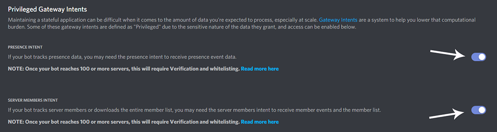

# 🔊 VoiceChat Discord Bot

> VoiceChatBot is a Discord bot made with the sole purpose of managing Voice Channels.

## 📃 About
Too many channels in your community for your members to join? VoiceChatBot eliminates countless unused voice channels and generates voice channels for your community when it is needed.

When you setup your bot for the first time, your community can join a permanent voice channel that allows them to generate a new voice channel, this then allows them to manage it using various commands. The voice channel will be automatically deleted once all members have left said channel.

This bot was originally a forked project from: [@Mattizhu](https://github.com/mattizhu/voicechatbot)

## 🔐 Bot Permissions
The Discord bot requires certain global permissions in your server to be able to work properly:

- View Channels
- Manage Channels
- Manage Roles
- Create Invites
- Send Messages
- Embed Links
- Add Reactions
- Mention Roles
- Manage Messages
- Read Message History
- Connect
- Move Members

This bot also accepts Discord ID's as well as @Mentions when calling certain commands; To take full advantage of this feature of the bot, please enable `PRESENCE INTENT` and `SERVER MEMBERS INTENT`. This will allow the bot to collect Cache for guild members.

## 📡 Command List

### Administrator Commands
| Name | Commands | Description |
| ---- | -------- | ----------- |
| **Setup** | `$setup` | Setup the Discord bot to run on your server. [If you have already setup your server, this command will act as a repair function] |
| **Manager** | `$manager <add/remove> <@Mention>` | Add or Remove a bot manager. [This also grants channel immunity, preventing members from kicking this Role/Member] |

### Manager Commands
| Name | Commands | Description |
| ---- | -------- | ----------- |
| **Staff** | `$staff <add/remove> <@Mention>` | Add or Remove a staff member. [This also grants channel immunity, preventing members from kicking this Role/Member] |
| **Lockdown** | `$lockdown` | Toggles the Voice System from being unavailable to available. |
| **Command** | `$command <disable/enable> <CommandName>` | Disable or Enable a command. (This does not effect a manager or the administrator global permission). |
| **Set Command Channel** | `$setcommandchannel <optional: remove> <@ChannelID>` | Set a new command channel for accepting Bot commands. |
| **Set Log Channel** | `$setlogchannel <optional: remove> <@ChannelID>` | Set a new Log channel for logging Commands, Connection and Creation events. |
| **Channel Creation** | `$channelcreation <slots/lock> <Number/True or False>` | Changes the slots and lock status of created channels. |
| **Disabled Commands List** | `$disabledcommands` | Prints out a list of all currently disabled commands. |
| **Manager Help** | `$managerhelp` | Shows all Manager commands. |
| **Staff List** | `$stafflist` | Checks all Manager and staff associated with the bot \[Also roles\]. |

> **Notice:** Any member who has the manager role can execute any of the below commands.

### Staff Commands
| Name | Commands | Description |
| ---- | -------- | ----------- |
| **Clear** | `$clear` | Deletes any vacant voice channels, only in the category that the bot operates in. |
| **Find** | `$find <@Mention>` | Find a member in any voice channel and return an invite for that channel. |
| **Blacklist** | `$blacklist <add/remove> <@Mention>` | Prevents a member from using the system to create channels. |
| **Ping** | `$ping` | Retrieves the API response times and bot Latency. |
| **Staff Help** | `$staffhelp` | Shows all Staff commands. |

> **Notice:** Any member who has the administrator global permission can execute any of the above commands.

### Community Member Commands
| Name | Commands  | Description |
| ---- | --------- | ----------- |
| **Help** | `$help`   | Displays a list of commands. |
| **Lock** | `$lock`   | Locks the voice channel to prevent anyone from joining, unless permitted. |
| **Unlock** | `$unlock` | Unlocks the voice channel to allow anyone to join. |
| **Kick** | `$kick <@Mention>` | Kicks a member out of the voice channel. |
| **Permit** | `$permit <@Mention>` | Permit a user to join your voice channel. |
| **Credits** | `$credits` | Displays awesome contributors who made this bot possible. :D |

> **Notice:** Some commands require you to be inside your own voice channel.

## ⚙️ Install
### Install with Nodejs

**Dependencies Install**

	npm install

**Run**

	npm start

## 😎 Developer
👤 **Mattizhu**
Twitter: [@Mattizhu](https://twitter.com/Mattizhu)
Github: [@Mattizhu](https://github.com/Mattizhu)
Discord: [Mattizhu#1993](https://discord.com/users/209966957385089024)

## 🤓 Developer
👤 **Huskies xD**
Twitter: [@HuskiesxD](https://twitter.com/HuskiesxD)
Github: [@AlexHuskiesMercer](https://github.com/AlexHuskiesMercer)
Discord: [Huskies xD#6455](https://discord.com/users/213310816231882752)

## **Big Thanks to**
Twitter: [@codedire](https://twitter.com/codedire)
Discord: [CODEdire#1944](https://discord.com/users/260539589523931138)

Twitter: [@CustomRL](https://twitter.com/CustomRL)
Github: [@CustomRL](https://github.com/CustomRL)
Discord: [Custom#5684](https://discord.com/users/282560443262959617)

## 📑 MIT Licensing
MIT License. Copyright (c) 2012-2020, Matthew Williams, Alex Mercer
